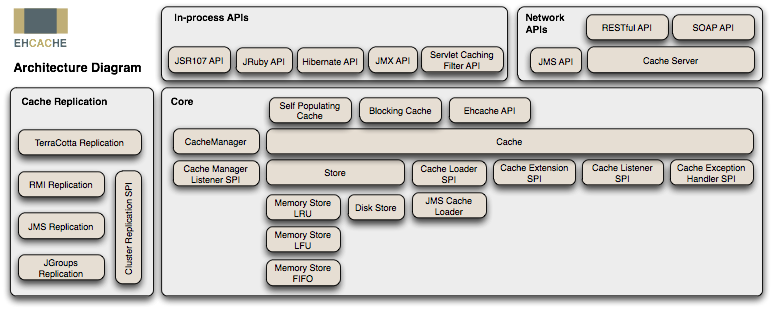

# SpringBoot Ehcache

## 目录

- [1. Ehcache概念](#1-Ehcache概念)
- [2. 项目依赖](#2-项目依赖)
- [3. 项目配置](#3-项目配置)
  - [3.1 缓存支持](#31-缓存支持)
  - [3.2 Ehcache配置文件](#32-Ehcache配置文件)
- [4. 项目说明](#4-项目说明)
  - [4.1 Ehcache使用](#41-Ehcache使用)
  - [4.2 缓存注解](#42-缓存注解)
    - [4.2.1 @CachePut](#421-CachePut)
    - [4.2.2 @Cacheable](#422-Cacheable)
    - [4.2.3 @CacheEvict](#423-CacheEvict)
    - [4.2.4 @CacheConfig](#424-CacheConfig)
  - [4.3 缓存key值](#43-缓存key值)
  - [4.4 缓存注解中使用SpEL](#44-缓存注解中使用SpEL)
- [5. 项目操作](#5-项目操作)

## 1. Ehcache概念
Ehcache是一个纯Java的进程内缓存框架，具有快速、精干等特点，是Hibernate中默认的CacheProvider。

下图是Ehcache在应用程序中的位置：



它的主要的特性有：

1. 快速
2. 简单
3. 多种缓存策略
4. 缓存数据有两级：内存和磁盘，因此无需担心容量问题
5. 缓存数据会在虚拟机重启的过程中写入磁盘
6. 可以通过RMI、可插入API等方式进行分布式缓存
7. 具有缓存和缓存管理器的侦听接口
8. 支持多缓存管理器实例，以及一个实例的多个缓存区域
9. 提供Hibernate的缓存实现
10. 等等

## 2. 项目依赖

```
<!-- 导入ehcache缓存 -->
<dependency>
    <groupId>net.sf.ehcache</groupId>
    <artifactId>ehcache</artifactId>
</dependency>
<dependency>
    <groupId>org.springframework.boot</groupId>
    <artifactId>spring-boot-starter-cache</artifactId>
</dependency>
```

## 3. 项目配置
### 3.1 缓存支持
为了使用Ehcache缓存，需要开启缓存支持，可以在SpringBoot启动类上添加`@EnableCaching`注解来开启缓存支持：

```
/**
 * 使用@EnableCaching注解开启缓存支持
 */
@EnableCaching
@SpringBootApplication
public class SpringbootEhcacheApplication {

    public static void main(String[] args) {
        SpringApplication.run(SpringbootEhcacheApplication.class, args);
    }
}
```

### 3.2 Ehcache配置文件
开启了缓存支持之后，还需要配置Ehcache相关属性，创建缓存，具体见`config/ehcache.xml`，并在项目配置文件中指定Ehcache配置文件位置：

```
# 指定ehcache配置文件位置
spring:
  cache:
    ehcache:
      config: classpath:config/ehcache.xml
```

## 4. 项目说明
### 4.1 Ehcache使用
项目中提供了`EhcacheUtil`工具类，可以使用该类进行Ehcache缓存的获取、添加和删除操作，具体使用可以查看`DemoController`类。

### 4.2 缓存注解
Spring提供了一套缓存注解，可以将方法执行结果添加到缓存中或移除指定key值的缓存，下面将简单介绍这些缓存注解：

#### 4.2.1 @CachePut
`@CachePut`注解可以标注在方法或类上，表示该方法或该类中的方法将进行缓存put操作。与`@Cacheable`不同的是，该注解不会导致标注方法跳过执行，它总是会执行方法并把方法结果保存到相关的缓存中。

该注解包含以下属性：

- `value`：`cacheNames`的别名
- `cacheNames`：进行缓存put操作的缓存名称，用于确定目标缓存
- `key`：key值产生规则，可以使用Spring表达式语言(SpEL)动态产生key值。默认将方法所有参数作为key值，除非自定义`keyGenerator`
- `keyGenerator`：自定义`org.springframework.cache.interceptor.KeyGenerator`key值产生器的bean名称，与`key`属性互斥
- `cacheManager`：自定义`org.springframework.cache.CacheManager`缓存管理器的bean名称，当未配置缓存解析器时可用于创建默认缓存解析器，与`cacheResolver`属性互斥
- `cacheResolver`：自定义`org.springframework.cache.interceptor.CacheResolver`缓存解析器的bean名称，用于确定方法使用的缓存实例
- `condition`：使用Spring表达式语言(SpEL)配置，用于指定进行缓存put操作的条件，满足条件则执行put操作，默认进行所有put操作
- `unless`：使用Spring表达式语言(SpEL)配置，用于指定阻止缓存put操作的条件，满足条件则阻止put操作，默认不阻止所有put操作。与`condition`属性不同的是，该表达式条件是在方法调用之后才进行判断的，所以可以将方法结果加入判断条件中

#### 4.2.2 @Cacheable
`@Cacheable`注解可以标注在方法或类上，表示该方法或该类中的方法的执行结果可以缓存。每次执行标注方法时，会检查在给定参数下是否执行过该方法。它使用方法的参数产生一个key值或者根据`key`或`keyGenerator`属性产生key值，然后在缓存中查找key值是否已有value值：如果没有value值，就会执行方法并将方法结果保存到相关的缓存中；如果存在value值，就不会执行方法，直接返回value值。

`@Cacheable`注解比`@CachePut`注解多了一个属性：

- `sync`：当多线程加载同一个key值的value值时是否同步执行方法，默认false。当同步时将产生几个限制：
  - 不支持`unless`属性
  - 只能指定一个缓存
  - 不能与其它缓存相关操作组合

#### 4.2.3 @CacheEvict
`@CacheEvict`注解可以标注在方法或类上，表示该方法或该类中的方法将进行缓存evict(移除)操作。

`@CacheEvict`注解比`@CachePut`注解少了`unless`属性，多了两个属性：

- `allEntries`：是否移除所有缓存，默认只移除指定key值缓存
- `beforeInvocation`：是否在方法调用之前移除缓存。设置为true时将在方法调用之前移除缓存，无论方法是正常结束还是抛出异常。默认是false，表示缓存将在方法正常结束后移除。

> 注意：
>
> 1. 以上注解除了`@CacheEvict`注解设置`beforeInvocation`属性为true之外，都需要方法正常结束(不抛出异常)才执行缓存操作
>
> 2. 在同一个类中调用另一个有缓存注解的方法，另一个方法缓存注解无效

#### 4.2.4 @CacheConfig
`@CacheConfig`可以标注在类上，它在类层面上提供了一种共享通用缓存配置的机制。当在类上标注时，它将为类中的缓存操作提供一系列默认的配置。

该注解包含以下属性：

- `cacheNames`：默认操作的缓存名称，如果在方法上没配置操作的缓存名称，则默认使用该缓存，否则忽略该项
- `keyGenerator`：默认的key值产生器的bean名称，如果在方法上没配置key值产生器，则默认使用该产生器，否则忽略该项。同时，它与`key`属性互斥，如果已配置了`key`属性，则忽略该项
- `cacheManager`：默认的缓存管理器的bean名称，用于创建默认的缓存解析器。如果在方法上没有配置缓存解析器和缓存管理器，并且该注解没有配置`cacheResolver`属性，则使用该项
- `cacheResolver`：默认的缓存解析器的bean名称，如果在方法上没有配置缓存解析器和缓存管理器，则使用该项

### 4.3 缓存key值
缓存注解通常会使用方法的参数值来生成key值：

- 当注解中没有指定`key`或`keyGenerator`属性时，默认使用`org.springframework.cache.interceptor.SimpleKeyGenerator`类来生成key值，生成代码如下：
  ```
  public class SimpleKeyGenerator implements KeyGenerator {
  
	  @Override
	  public Object generate(Object target, Method method, Object... params) {
		  return generateKey(params);
	  }
  
	  /**
	   * 根据指定参数值生成key值
	   */
	  public static Object generateKey(Object... params) {
	      // 没有参数时返回空key值
		  if (params.length == 0) {
			  return SimpleKey.EMPTY;  // new SimpleKey()
		  }
		  // 有1个参数时
		  if (params.length == 1) {
			  Object param = params[0];
              // 参数值不是null或数组，返回参数值，也就是直接使用参数值作为key值
			  if (param != null && !param.getClass().isArray()) {
				  return param;
			  }
		  }
		  // 返回SimpleKey包装的key值
		  return new SimpleKey(params);
	  }
  
  }
  ```

- 当注解中指定了`key`或`keyGenerator`属性时，则按照指定规则生成key值

### 4.4 缓存注解中使用SpEL
缓存注解中的`key`、`condition`和`unless`属性都可以使用Spring表达式语言(SpEL)来指定相关属性值。

首先，可以使用`# + 参数名`来表示参数的值，如：`#id`。有时候，需要额外拼接字符串，注意加上`''`包裹起来，表示它是普通字符串，如：`#id +'_key'`，其中`_key`就是普通字符串。除此之外，还有一些比较特殊的值可以用于SpEL：

- `#result`，表示方法返回结果
- `#root`，表达式根对象，包含以下属性：
  - `#root.caches`，表示使用的缓存对象集合
  - `#root.method`，表示方法的Method对象
  - `#root.methodName`，表示方法名
  - `#root.target`，表示目标类实例对象
  - `#root.targetClass`，表示目标类的Class对象
  - `#root.args`，表示方法参数数组，如：`#root.args[1]`表示获取第2个参数，也可使用`#a1`或`#p1`获取

## 5. 项目操作
项目启动之后，可以访问各个Controller中的url来了解Ehcache缓存及缓存注解的基本使用。其中`DemoController`对应Ehcache缓存的基本使用，其它Controller分别对应几个缓存注解中某些属性的使用。
